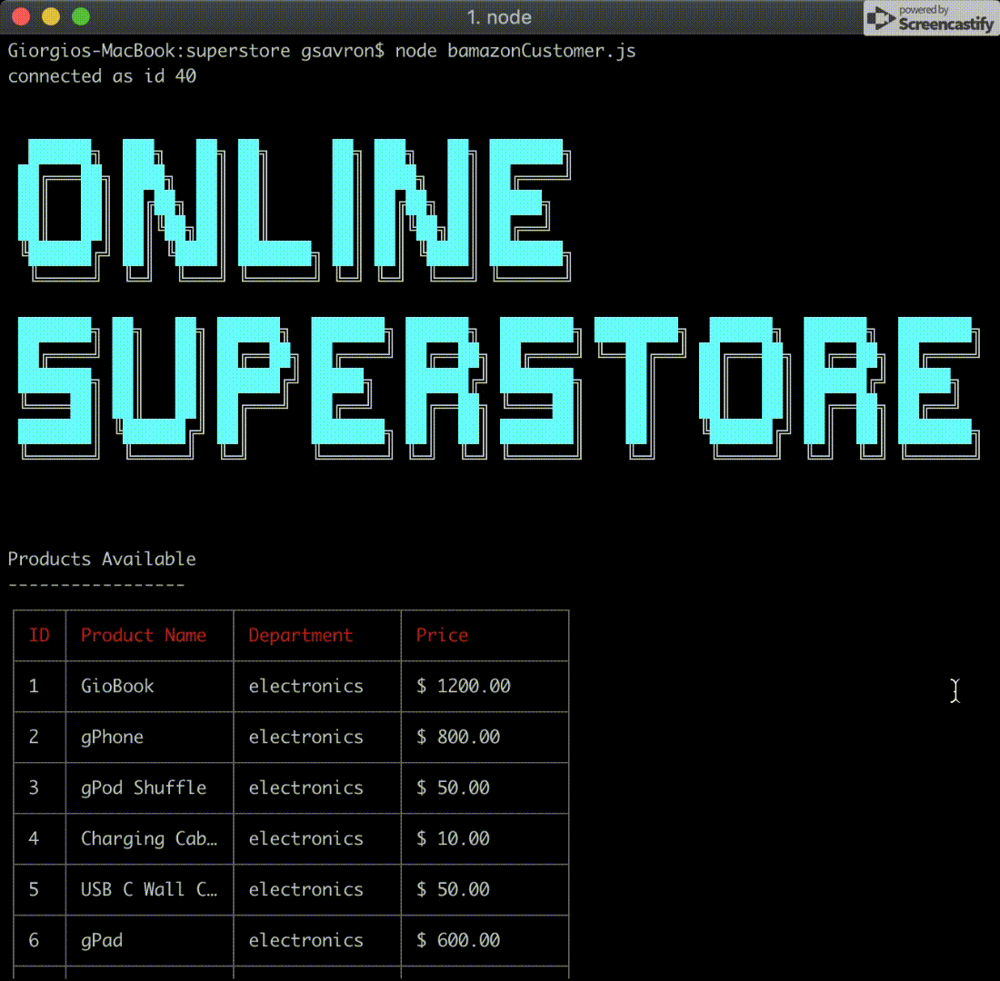
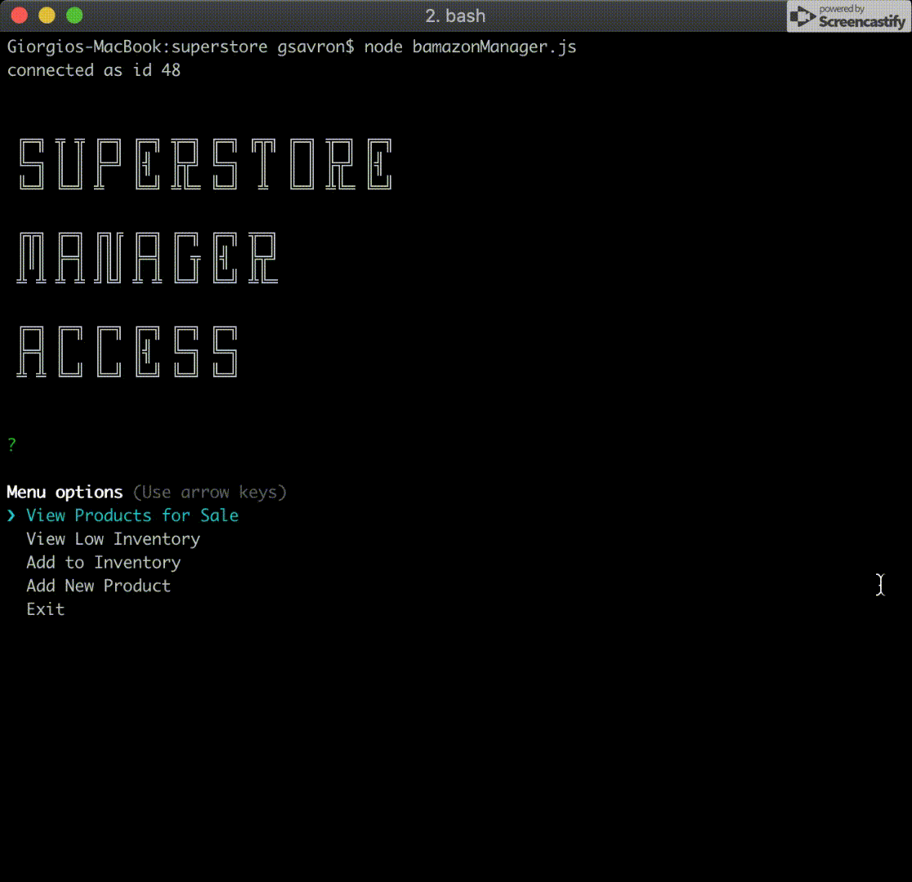
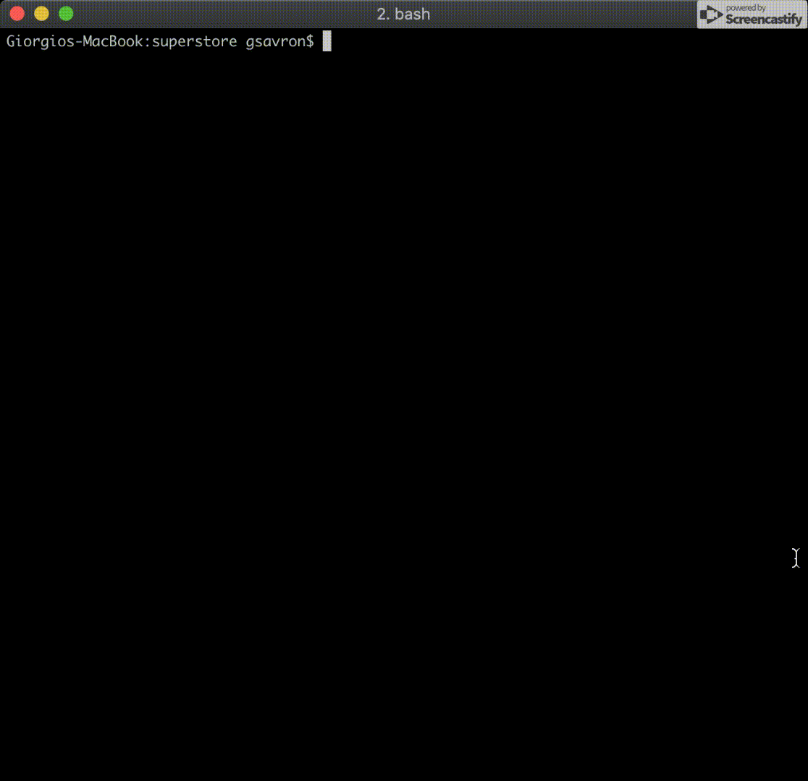
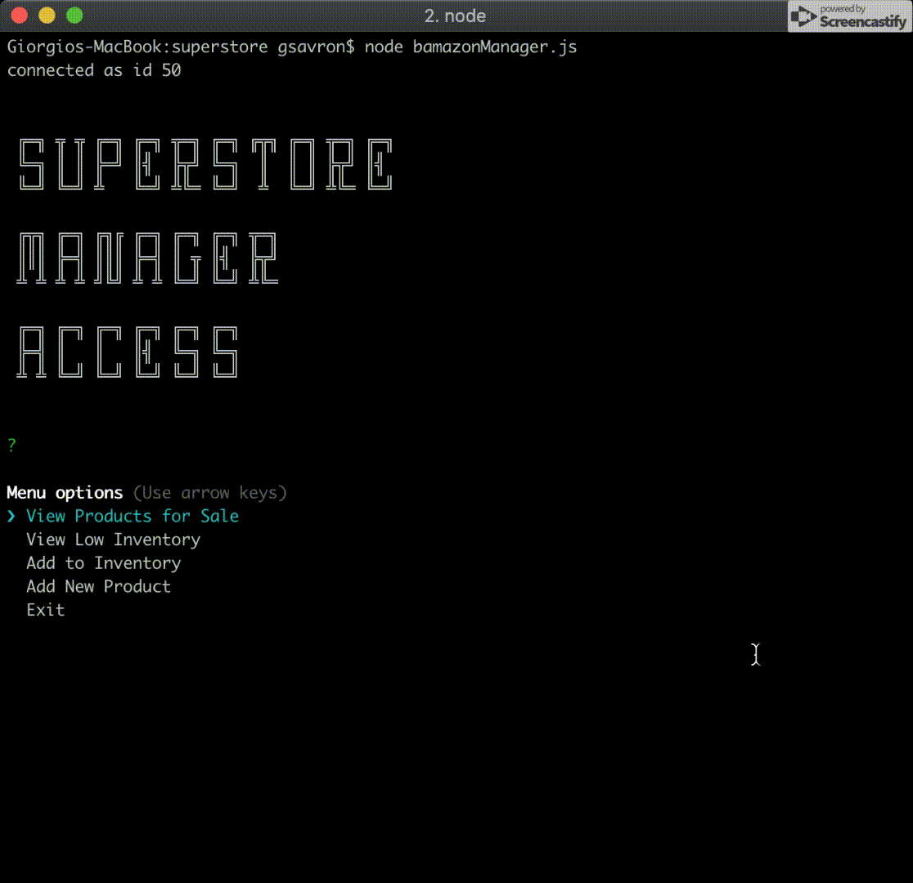
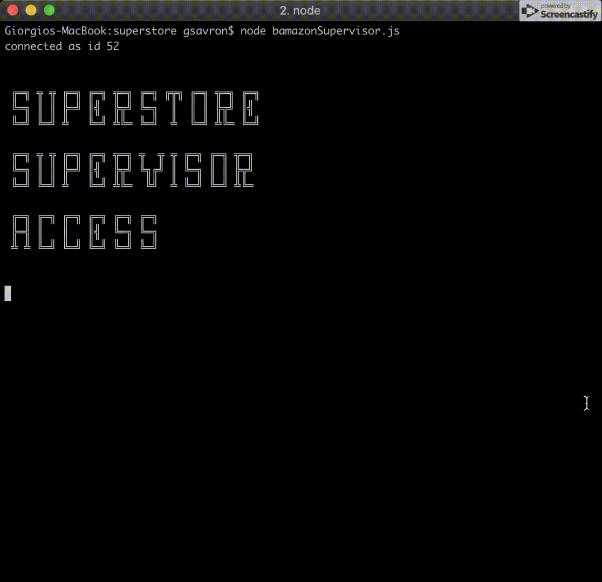
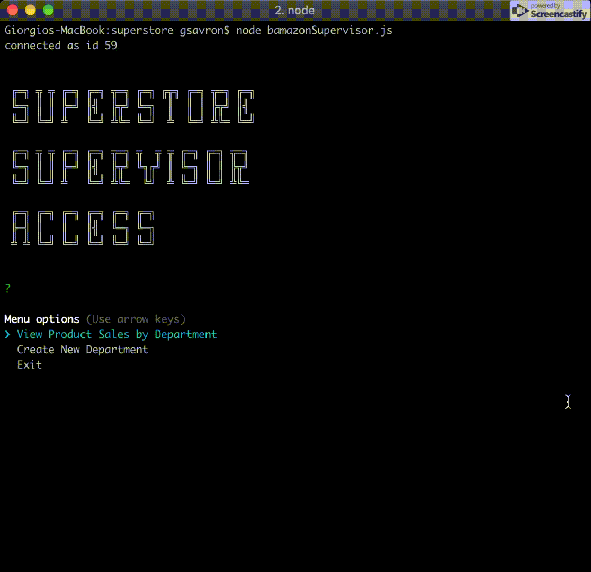

# superstore

This is an online storefront you access through your terminal!

**This is a node.js CLI store built using JS ans MySQL**
    *Use node bamazonCustomer.js for Customer Experience
    *Use node bamazonManager.js for Manager Experience
    *Use node bamazonSupervisor.js for Supervisor Experience

**Customer Experience**

    * The customer is shown an list of products available for purchase
    * Then the customer is asked to provide the ID of the product they want to purchase along with the quantity they want
    * The customer is shown the cart with the total amount they will have to pay
    * The customer is asked to provide payment and then the transaction is complete

**Customer Purchase Preview**

**Manager Experience**

    * The manager is shown a list of option they can access in their application
        * Menu options (Use arrow keys)
            ❯ View Products for Sale
            View Low Inventory
            Add to Inventory
            Add New Product
            Exit
    * View Products for Sale
        * A list of Products along with their price and stock quantity is shown
    * View Low Inventory
        * A list of products with 10 items or less remaining is shown
    * Add to Inventory
        * The manager is asked to provide the ID for the product to which they are adding inventory along with the quantity they are adding
    * Add New Product
        * The Manager is asked what the name, price, and quantity of the new product for sale

**Manager View Products for Sale Preview**

**Manager View Low Inventory Preview**

**Manager Add Inventory Preview**

**Manager Add New Product Preview**

**Supervisor Experience**

    * The suervisor is shown a list of option they can access in their application
        * Menu options (Use arrow keys)
            ❯ View Product Sales by Department
            Create New Department
            Exit
    * View Product Sales by Department
        * The supervisor will be shown a table where each department is shown along with overhead costs, total sales, and total profits
    * Create New Department
        * The supervisor will be prompted to create a new department in the store by being asked for the name and the overhead costs

**Supervisor Sales/Profits Preview**

**Supervisor Add New Department Preview**

**Technologies Used**

    * node.js
    * mysql
    * npm
    * cfonts
    * inquirer
    * cli-table